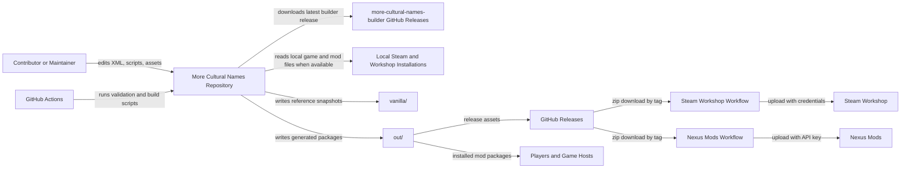
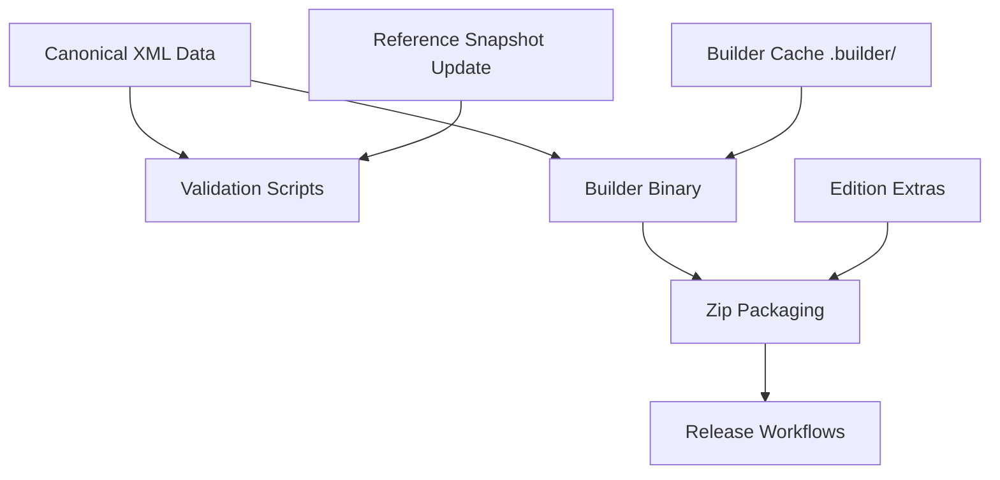
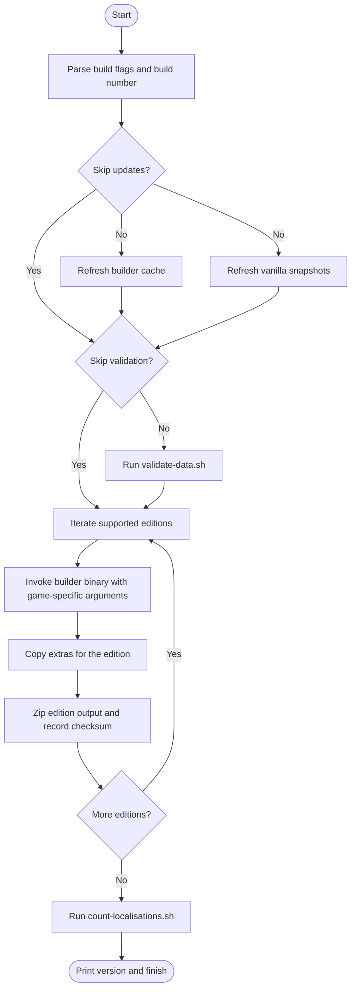
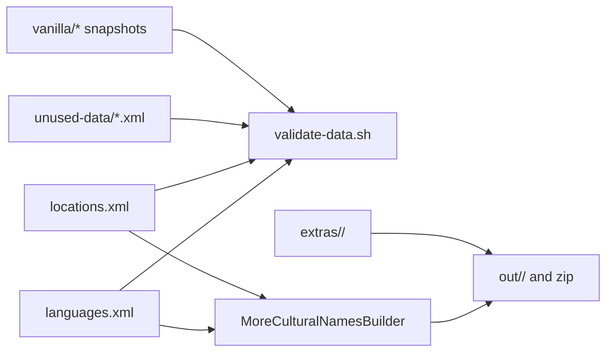
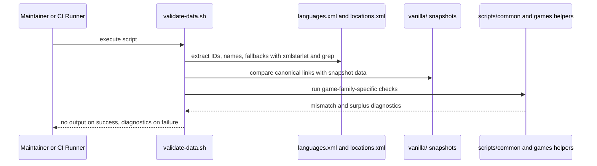
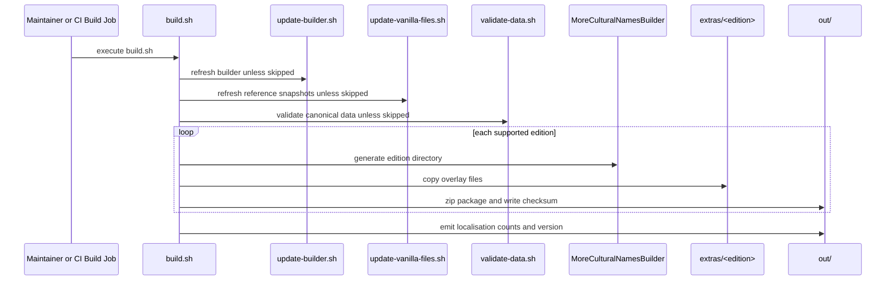
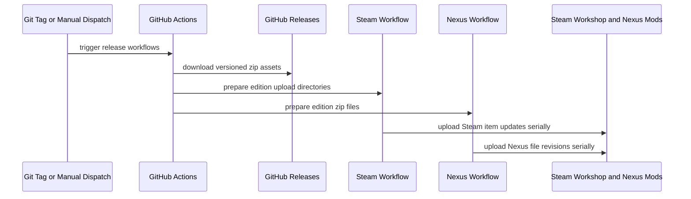
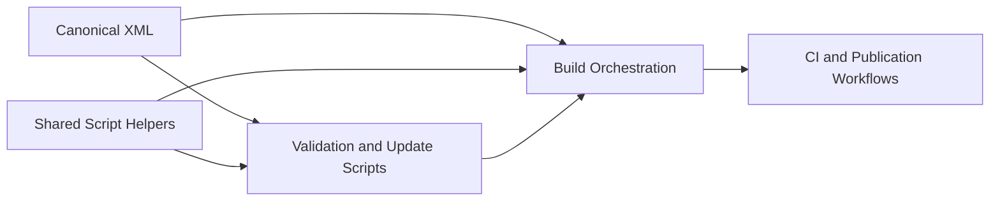

# More Cultural Names Architecture

This document records the current architecture of the More Cultural Names repository as of 18 August 2026. It covers the repository-owned source data, validation and build automation, packaging flow, and release integrations that produce game-specific mod editions for supported Paradox titles and companion mods.

## 📑 Table of Contents

- [Purpose](#-purpose)
- [System Context](#-system-context)
- [Architectural Style](#-architectural-style)
- [Runtime Flow](#-runtime-flow)
- [Components](#-components)
- [Architectural Areas](#-architectural-areas)
  - [Canonical Source Data](#canonical-source-data)
  - [Build And Validation Scripts](#build-and-validation-scripts)
  - [Reference Snapshots And Extras](#reference-snapshots-and-extras)
  - [Publication And Storefront Assets](#publication-and-storefront-assets)
- [Data Architecture](#-data-architecture)
- [Interfaces And Integrations](#-interfaces-and-integrations)
- [Key Flows](#-key-flows)
  - [Validation Flow](#validation-flow)
  - [Build And Packaging Flow](#build-and-packaging-flow)
  - [Release Publication Flow](#release-publication-flow)
- [Cultural Name Resolution Model](#-cultural-name-resolution-model)
- [Cross-Cutting Concerns](#-cross-cutting-concerns)
  - [Security And Privacy](#security-and-privacy)
  - [Error Handling](#error-handling)
  - [Observability](#observability)
  - [Configuration](#configuration)
  - [Concurrency And Resource Use](#concurrency-and-resource-use)
- [Dependency Direction And Rules](#-dependency-direction-and-rules)
- [External Dependencies](#-external-dependencies)
- [Deployment And Operations](#-deployment-and-operations)
- [Compatibility Contracts](#-compatibility-contracts)
- [Testing And Verification](#-testing-and-verification)
- [Design Constraints](#-design-constraints)
- [Extension Points](#-extension-points)
  - [Adding A Supported Edition](#adding-a-supported-edition)
  - [Extending Validation For A Game Family](#extending-validation-for-a-game-family)
- [Architecture Decisions](#-architecture-decisions)
- [Source Map](#-source-map)
- [Related Documentation](#-related-documentation)

## 🎯 Purpose

The repository’s principal responsibility is to maintain a canonical, game-agnostic catalogue of languages and location names, then transform that catalogue into multiple mod packages that conform to the directory structure and localisation rules of each supported game or community mod. This document is intended for contributors who revise the XML datasets, shell automation, release workflows, or compatibility assets, and for maintainers who need to evaluate the impact of a change across validation, build, and publication boundaries.

## 🌐 System Context

The repository boundary contains the source datasets, validation scripts, packaging scripts, distribution metadata, and static documentation pages. A maintainer or CI job initiates validation and build runs. The build consumes repository XML, optional local game or workshop installations, and an externally downloaded builder binary. The outputs are per-edition mod directories and zip archives, which are subsequently published to GitHub Releases, Steam Workshop, and Nexus Mods.



The principal external boundaries are:
- **Contributors and maintainers:** Revise the canonical data, execute scripts locally, and inspect validation results.
- **GitHub Actions:** Executes repository validation, build, and publication workflows defined under [.github/workflows](.github/workflows).
- **More Cultural Names Builder:** External binary downloaded by [scripts/update-builder.sh](scripts/update-builder.sh) and invoked by [scripts/build.sh](scripts/build.sh) to emit game-specific mod structures.
- **Local Steam and workshop installations:** Optional local sources used by [scripts/update-vanilla-files.sh](scripts/update-vanilla-files.sh) to refresh reference snapshots under [vanilla](vanilla).
- **Distribution platforms:** GitHub Releases, Steam Workshop, and Nexus Mods distribute the generated zip archives.

## 🏗️ Architectural Style

The verified architecture is a data-centric batch pipeline combined with a compatibility-oriented mod packaging model. The repository treats [languages.xml](languages.xml) and [locations.xml](locations.xml) as canonical source data, then delegates game-specific rendering to an external builder binary while retaining repository-owned validation, reference-snapshot generation, and packaging logic in shell scripts. This separates editorial data ownership from format emission, but it also means the produced mod structure depends upon contracts shared with a builder maintained in a separate repository.



The principal architecture boundaries are:
- **Canonical data layer:** Owns language identifiers, game IDs, fallback chains, location identities, and multilingual names.
- **Automation layer:** Owns validation, reference refresh, builder acquisition, edition orchestration, and packaging.
- **Reference data layer:** Owns snapshots copied or derived from installed games and community mods for link verification.
- **Publication layer:** Owns CI-triggered build validation and store uploads, but not the mod transformation itself.

## 🔄 Runtime Flow



The principal runtime sequence is:
1. [scripts/build.sh](scripts/build.sh) computes a version and content checksum, then optionally refreshes the builder cache and reference snapshots.
2. The build optionally runs [scripts/validate-data.sh](scripts/validate-data.sh) and aborts on any emitted validation diagnostics.
3. The build iterates a fixed catalogue of game editions, invokes the external builder for each one, overlays extras from [extras](extras), creates zip archives in `out/`, and prints localisation coverage statistics.

## 🧩 Components

| Component | Responsibility | Principal Dependencies | Lifetime or Ownership |
|-----------|----------------|------------------------|-----------------------|
| `languages.xml` | Canonical catalogue of languages, game-specific language IDs, and fallback chains | Referenced by validation scripts and the builder | Repository-owned source file |
| `locations.xml` | Canonical catalogue of location entities, per-game location IDs, multilingual names, and metadata such as Wikidata IDs | Referenced by validation scripts and the builder | Repository-owned source file |
| `unused-data/` | Staging area for unused or deferred languages and locations | Read by validation and coverage counting | Repository-owned source directory |
| `scripts/validate-data.sh` | Consistency checks between canonical data and game-specific reference data | `xmlstarlet`, shared shell helpers, `vanilla/` snapshots | Executed per validation or build run |
| `scripts/update-vanilla-files.sh` | Refreshes reference snapshots from local installations or remote fallbacks | Local Steam/workshop paths, `wget`, shared helpers | Executed on demand or from build preamble |
| `scripts/update-builder.sh` | Downloads and caches the current builder release in `.builder/` | GitHub API, `wget`, `unzip` | Executed on demand or from build preamble |
| `scripts/build.sh` | Orchestrates versioning, validation, builder invocation, extras copy, zip packaging, and checksum-based skipping | Canonical XML, builder cache, extras, shell utilities | Principal composition root for local and CI builds |
| `.github/workflows/*.yml` | Executes CI validation and publishes release assets to external platforms | GitHub Actions runners, repository scripts, platform secrets | CI-owned workflow definitions |

## 🗂️ Architectural Areas

### Canonical Source Data

Paths:
- [languages.xml](languages.xml)
- [locations.xml](locations.xml)
- [unused-data/languages.xml](unused-data/languages.xml)
- [unused-data/locations.xml](unused-data/locations.xml)

Responsibilities:
- Define stable language identifiers independent of any single game.
- Map each canonical language or location to one or more game-specific identifiers.
- Store multilingual location names, optional adjectives, fallback relations, and editorial metadata.

Boundary rules:
- Source XML is the authoritative input for build and validation; generated mod output does not feed back into it.
- Game-specific IDs belong in the XML records rather than being scattered through build scripts.
- Unused data remains segregated under [unused-data](unused-data) so validation and coverage scripts can distinguish active from parked records.

### Build And Validation Scripts

Paths:
- [scripts/build.sh](scripts/build.sh)
- [scripts/validate-data.sh](scripts/validate-data.sh)
- [scripts/update-builder.sh](scripts/update-builder.sh)
- [scripts/update-vanilla-files.sh](scripts/update-vanilla-files.sh)
- [scripts/count-localisations.sh](scripts/count-localisations.sh)
- [scripts/common](scripts/common)
- [scripts/update-location-links](scripts/update-location-links)

Responsibilities:
- Resolve repository paths and local installation paths.
- Validate canonical data against internal invariants and external reference snapshots.
- Acquire the external builder and orchestrate per-edition packaging.

Boundary rules:
- Shared shell logic is centralised under [scripts/common](scripts/common) and game-family checks under [scripts/common/games](scripts/common/games).
- Validation scripts may read local game or workshop installations indirectly via refreshed `vanilla/` snapshots, but build scripts do not edit the canonical XML.
- The edition catalogue is declared in [scripts/build.sh](scripts/build.sh); each new edition requires an explicit entry rather than automatic discovery.

### Reference Snapshots And Extras

Paths:
- [vanilla](vanilla)
- [extras](extras)
- [assets](assets)

Responsibilities:
- Persist copied or derived upstream reference data used for validation.
- Provide edition-specific files copied on top of builder output.
- Store publication graphics and localisation text assets.

Boundary rules:
- Files under [vanilla](vanilla) are reference artefacts, not canonical authored content.
- Files under [extras](extras) are overlay content applied after builder output exists.
- Asset directories support documentation and distribution packaging, but they do not influence canonical XML semantics.

### Publication And Storefront Assets

Paths:
- [.github/workflows](.github/workflows)
- [docs](docs)
- [README.md](README.md)

Responsibilities:
- Validate repository changes in CI.
- Publish generated archives to external distribution platforms.
- Provide static pages and contributor-facing distribution guidance.

Boundary rules:
- Publication workflows consume versioned archives; they do not rebuild release content from source in the release jobs.
- Static documentation under [docs](docs) complements distribution channels but does not serve as source input to builds.

## 💾 Data Architecture

The architecture revolves around canonical XML documents and derived snapshot files. [languages.xml](languages.xml) stores language identities, external ISO codes where known, per-game language IDs, and fallback chains. [locations.xml](locations.xml) stores canonical location identities, per-game location links, optional metadata such as `WikidataId`, and large sets of `<Name>` entries keyed by canonical language IDs. The build process does not persist a database; instead, it reads immutable source files, derives game-specific mod files through the builder, then writes ephemeral build output to `out/` and cached support files to `.builder/` and `vanilla/`.



| Data or Store | Owner | Representation and Storage | Lifecycle or Consistency |
|---------------|-------|----------------------------|--------------------------|
| `Language Catalogue` | Repository maintainers | XML in [languages.xml](languages.xml) | Revised manually; validated for link consistency and fallback references |
| `Location Catalogue` | Repository maintainers | XML in [locations.xml](locations.xml) | Revised manually; validated against game-specific IDs and reference snapshots |
| `Unused Editorial Data` | Repository maintainers | XML in [unused-data](unused-data) | Retained separately from active data; counted by coverage scripts but excluded from active builds |
| `Reference Snapshots` | Automation scripts | Text and YAML files in [vanilla](vanilla) | Refreshed from installed games or remote sources; can become stale between refresh runs |
| `Builder Cache` | Automation scripts | Downloaded binary and version file in `.builder/` | Replaced when the external builder release version changes |
| `Edition Output` | Build orchestration | Generated directories and zip archives in `out/` | Recreated on demand; skipped when checksum matches current content and builder version |

## 🔌 Interfaces And Integrations

| Interface or Integration | Direction | Contract | Owner | Failure Semantics |
|--------------------------|-----------|----------|-------|-------------------|
| `Canonical XML Input` | Inbound | XML structure consumed by shell validation and the builder | Repository | Invalid or inconsistent data causes validation diagnostics and build termination |
| `Builder CLI` | Outbound | Command-line invocation of `.builder/MoreCulturalNamesBuilder` with `--lang`, `--loc`, `--game`, `--id`, `--name`, `--ver`, and edition-specific flags | [scripts/build.sh](scripts/build.sh) | Missing binary or failed generation terminates the build |
| `GitHub Releases API` | Outbound | Latest release metadata for `hmlendea/more-cultural-names-builder` | [scripts/update-builder.sh](scripts/update-builder.sh) | Download or extraction failure prevents builder refresh and subsequent builds |
| `Local Game File System` | Outbound | File copies and aggregation from Steam or workshop directories resolved in [scripts/common/paths.sh](scripts/common/paths.sh) | [scripts/update-vanilla-files.sh](scripts/update-vanilla-files.sh) | Absent local files cause skipped snapshot refresh or remote fallback when implemented |
| `GitHub Actions Validation` | Inbound | Push, pull request, and manual workflow triggers defined in [.github/workflows/validate.yml](.github/workflows/validate.yml) | GitHub Actions | Non-empty validation output or shellcheck failures fail CI |
| `Steam Workshop Upload` | Outbound | Tagged-release workflow downloads release zips and uploads with `hmlendea/steam-workshop-update` | [.github/workflows/steam-workshop.yml](.github/workflows/steam-workshop.yml) | Upload failures stop that edition release; workflow serialises uploads to reduce rate limiting |
| `Nexus Mods Upload` | Outbound | Tagged-release or manual workflow downloads release zips and uploads with `Nexus-Mods/upload-action` | [.github/workflows/nexus-mods.yml](.github/workflows/nexus-mods.yml) | Upload failures stop that edition release |

## 🔀 Key Flows

### Validation Flow



The validation flow is intentionally shell-based and diagnostic-oriented. Instead of producing a structured report, it emits human-readable findings only when a constraint is violated. CI and build orchestration both treat any emitted output as a failure signal, so the absence of output is a compatibility contract between [scripts/validate-data.sh](scripts/validate-data.sh) and its callers.

### Build And Packaging Flow



The build flow has a single composition root in [scripts/build.sh](scripts/build.sh). Each edition is declared explicitly with game ID, version compatibility, metadata, and optional extra arguments such as landed-title file names or dependencies. The build avoids unnecessary repetition through a checksum that combines XML content, the computed version, and the cached builder version.

### Release Publication Flow



The release publication jobs do not regenerate mod content. They assume the tagged GitHub release already contains correctly named archives and merely transform those release assets into the shape required by each store workflow. This keeps publication deterministic but couples store automation to archive naming and tag conventions.

## ⚙️ Cultural Name Resolution Model

The repository’s domain model is built around a canonical identity layer that decouples editorial data from any single game’s nomenclature. Languages are identified once, may carry ISO code metadata, and can list multiple `GameId` mappings plus `FallbackLanguages`. Locations are likewise identified once, can list multiple `GameId` mappings across different supported titles, and attach many `<Name>` entries keyed by canonical language IDs. The builder is responsible for projecting these canonical records into each game’s required localisation format, while validation ensures the per-game links remain aligned with refreshed reference snapshots.

This model has two architectural consequences:
- The repository can support multiple games and mod variants without duplicating the full editorial name catalogue per target.
- Compatibility depends upon the continued stability of canonical IDs and fallback semantics, because those identifiers are referenced by data, validation scripts, and the builder contract.

## 🧵 Cross-Cutting Concerns

### Security And Privacy

The repository does not store personal data as part of its build artefacts. The main trust boundaries are CI secrets for Steam and Nexus publication, local file-system access to installed games, and network access to external release endpoints. Publication secrets are sourced from GitHub Actions secrets in [.github/workflows/steam-workshop.yml](.github/workflows/steam-workshop.yml) and [.github/workflows/nexus-mods.yml](.github/workflows/nexus-mods.yml); the repository documents the integration contract but does not embed credentials.

### Error Handling

Failure handling is predominantly fail-fast. [scripts/build.sh](scripts/build.sh) aborts when validation emits diagnostics or when the builder fails to create an expected edition directory. [scripts/update-builder.sh](scripts/update-builder.sh) and [scripts/update-vanilla-files.sh](scripts/update-vanilla-files.sh) rely on command exit status and file presence rather than structured retries. Validation scripts report mismatches as text lines and delegate the decision to abort to the caller.

### Observability

Operational observability is limited to standard output, standard error, and CI job logs. [scripts/build.sh](scripts/build.sh) prints high-level progress, reuse decisions, and the computed mod version. [scripts/count-localisations.sh](scripts/count-localisations.sh) prints per-game counts and coverage ratios. There is no metrics, tracing, or machine-readable report channel, so diagnosing a failure depends upon shell output preserved by the invoking terminal or CI job.

### Configuration

| Configuration Area | Source | Responsibility | Override or Secret Policy |
|--------------------|--------|----------------|---------------------------|
| `Repository Paths` | [scripts/common/paths.sh](scripts/common/paths.sh) | Resolves source, output, extras, snapshot, and local installation directories | Derived from `pwd`, `HOME`, and expected Steam or Paradox directories |
| `Build Version` | First positional argument to [scripts/build.sh](scripts/build.sh) | Controls the patch component of the generated version string | Defaults to `0` when absent or invalid |
| `Build Flags` | Command-line switches to [scripts/build.sh](scripts/build.sh) | Permits skipping snapshot updates or validation | Plain-text local operator input |
| `Builder Version` | GitHub release metadata plus `.builder/version.txt` | Selects the cached builder binary version | External source; cached locally after download |
| `Publication Secrets` | GitHub Actions secrets | Authenticates Steam and Nexus uploads | Secret-only; not stored in the repository |

### Concurrency And Resource Use

The principal automation is sequential. [scripts/build.sh](scripts/build.sh) iterates editions one by one and writes into a shared `out/` directory, which simplifies packaging and checksum management at the cost of longer wall-clock duration. Both release workflows declare `max-parallel: 1`, and the Steam workflow adds a deliberate cooldown to reduce authentication rate limiting. Local snapshot refreshes and validation can scan large text collections under installed games or workshop mods, so disk I/O dominates more than CPU concurrency.

## 🧭 Dependency Direction And Rules

The permitted dependency direction flows from canonical data to shared shell logic to orchestration and finally to publication. Reference snapshots and extras are supporting inputs, not sources of truth.



The principal dependency rules are:
- Canonical XML remains the authoritative editorial source; `vanilla/` snapshots and generated output may validate or derive from it but must not replace it.
- Shared helpers under [scripts/common](scripts/common) may be imported by top-level scripts; top-level scripts should not duplicate game-path and parsing logic.
- Publication workflows consume versioned build artefacts; they should not own canonical data transformation logic.
- Extras are overlays on generated output and must not encode assumptions that contradict the canonical XML or builder contracts.

## 📦 External Dependencies

| Dependency | Responsibility | Integration Boundary | Architectural Consequence |
|------------|----------------|----------------------|---------------------------|
| `More Cultural Names Builder` | Transforms canonical XML into game-specific mod file structures | [scripts/update-builder.sh](scripts/update-builder.sh) and [scripts/build.sh](scripts/build.sh) | Core transformation logic lives outside this repository, so builder compatibility is a critical contract |
| `xmlstarlet` | Structured XML selection during validation | [scripts/validate-data.sh](scripts/validate-data.sh) and [.github/workflows/validate.yml](.github/workflows/validate.yml) | Validation requires a non-default system package in CI and on contributor machines |
| `shellcheck` | Static verification of shell scripts in CI | [.github/workflows/validate.yml](.github/workflows/validate.yml) | Shell automation quality is guarded separately from data validation |
| `wget`, `curl`, `unzip`, `zip` | Download, extraction, and packaging utilities | Build and update scripts | Local builds depend upon common POSIX tooling being available |
| `GitHub Actions` | Hosted automation for validation and publication | [.github/workflows](.github/workflows) | Release correctness depends upon workflow continuity and secret configuration |
| `Steam Workshop Update Action` | Uploads built editions to Steam Workshop | [.github/workflows/steam-workshop.yml](.github/workflows/steam-workshop.yml) | External action behaviour and Steam authentication policies influence release reliability |
| `Nexus Mods Upload Action` | Uploads release archives to Nexus Mods | [.github/workflows/nexus-mods.yml](.github/workflows/nexus-mods.yml) | Store publication is coupled to third-party action semantics and Nexus API availability |

## 🚀 Deployment And Operations

This repository does not deploy a long-running service. Its operational model is a locally or CI-invoked build workspace that emits static mod packages and publication assets.

| Concern | Current Design | Architectural Consequence |
|---------|----------------|---------------------------|
| Process topology | One shell-driven process tree per validation or build run | No inter-process coordination layer is required |
| Persistent state | Canonical XML, reference snapshots, extras, and workflow files live in the repository; builder cache and build output are workspace-local | Operators can rebuild from source, but snapshot freshness and builder cache state affect results |
| Scaling | Edition builds and store uploads are serialised | Simpler state management, slower full-release throughput |
| Recovery | Failed validation or build runs terminate and are rerun from the beginning | There is no checkpoint beyond per-edition checksum skipping in `out/` |
| File-system requirements | Local snapshot refresh depends on expected Steam, workshop, and Paradox mod directories | Full local refresh is environment-sensitive and may be unavailable on CI or contributor machines |
| Network requirements | Builder refresh and some snapshot fallbacks depend on remote downloads; store publication depends on external APIs | Offline builds are only possible when the builder cache and required snapshots already exist |

## 🛡️ Compatibility Contracts

| Contract | Owner | Invariant | Verification | Change Policy |
|----------|-------|-----------|--------------|---------------|
| `Canonical Language IDs` | Repository maintainers | IDs used in XML names and fallback chains remain stable enough for builder and validation consumers | Manual review plus [scripts/validate-data.sh](scripts/validate-data.sh) | Renaming requires coordinated data and builder changes |
| `Canonical Location IDs` | Repository maintainers | IDs remain the join key for per-game mappings and generated output | Manual review plus [scripts/validate-data.sh](scripts/validate-data.sh) | Treat as compatibility-sensitive identifiers |
| `Builder CLI Arguments` | Build orchestration | The builder continues to accept the argument set encoded in [scripts/build.sh](scripts/build.sh) | Build execution | Any CLI change requires script updates before releases can proceed |
| `Release Archive Naming` | CI publication workflows | Archives follow `mcn_<GAME>_<VERSION>.zip` naming | Release workflow preparation steps | Changing the naming scheme requires coordinated workflow revision |
| `Edition Directory Layout` | Builder plus extras overlay | Each built edition contains the expected mod directory and descriptor file used for zipping and upload | Build execution and store upload runs | Layout changes require builder, extras, and workflow coordination |
| `No Output Means Validation Success` | Validation scripts and callers | [scripts/validate-data.sh](scripts/validate-data.sh) emits nothing when all checks pass | Local and CI validation execution | Preserve this caller-visible contract or revise every caller |

## ✅ Testing And Verification

Architecture verification is implemented primarily through shell-based data validation and CI static analysis rather than unit tests. The validated boundaries are canonical data integrity, alignment between canonical game links and refreshed upstream snapshots, and shell script quality checked with shellcheck. Local build verification additionally confirms that the external builder can generate each declared edition and that extras overlay and zip packaging still match workflow expectations.

Execute the principal automated verification with:

```bash
bash scripts/validate-data.sh | tr '\0' '\n'
```

Further architecture-sensitive verification commands are:

```bash
shopt -s globstar nullglob; shellcheck **/*.sh --severity error
```

```bash
bash scripts/build.sh --skip-validation --skip-updates
```

Material coverage gaps remain:
- There are no repository-local unit tests for the transformation logic because that logic resides in the external builder.
- Full snapshot refresh validation depends upon local game or workshop installations matching the path assumptions in [scripts/common/paths.sh](scripts/common/paths.sh).
- Release workflows verify upload automation only when tagged or manually dispatched; they are not fully exercised on every change.

## ⚠️ Design Constraints

- **External Builder Dependency:** The repository delegates core file emission to an external binary, which reduces duplicated logic but creates a hard compatibility boundary outside the repository.
- **Environment-Sensitive Snapshot Refresh:** [scripts/update-vanilla-files.sh](scripts/update-vanilla-files.sh) assumes specific local installation paths and optional remote fallbacks, so reference refresh is not uniformly reproducible across environments.
- **Large Canonical Datasets:** The XML catalogues are substantial and edited directly, which keeps the source of truth simple but makes schema drift and merge conflicts more probable.
- **Serial Edition Catalogue:** Supported editions are enumerated manually in [scripts/build.sh](scripts/build.sh), so onboarding a new target is explicit but not declarative.
- **Shell-Centric Diagnostics:** Validation reports are human-readable text streams rather than structured artefacts, which is adequate for maintainers but less amenable to tooling reuse.

## 🔧 Extension Points

### Adding A Supported Edition

1. Add or revise the game-specific canonical mappings in [languages.xml](languages.xml) and [locations.xml](locations.xml).
2. Add the edition’s reference snapshot handling and local path definitions where necessary in [scripts/common/paths.sh](scripts/common/paths.sh) and [scripts/update-vanilla-files.sh](scripts/update-vanilla-files.sh).
3. Register the edition in [scripts/build.sh](scripts/build.sh) and add validation coverage required to preserve packaging and link contracts.

The extension must preserve the existing archive naming convention, builder CLI contract, and any extras overlay expectations for the target edition.

### Extending Validation For A Game Family

1. Implement the game-family-specific helper logic under [scripts/common/games](scripts/common/games) or [scripts/update-location-links](scripts/update-location-links).
2. Call the new checks from [scripts/validate-data.sh](scripts/validate-data.sh) in the appropriate branch for that game family.
3. Add manual or CI verification to confirm the new diagnostics respect the no-output-on-success contract.

The extension must preserve caller expectations that validation emits actionable lines only for genuine mismatches and that top-level scripts can continue treating any output as failure.

## 📝 Architecture Decisions

| Decision | Rationale | Consequence | Record |
|----------|-----------|-------------|--------|
| Canonicalise languages and locations in shared XML files | Multiple games and companion mods reuse overlapping cultural and geographic data | Editorial reuse is high, but canonical IDs become compatibility-sensitive | Documented here |
| Keep validation and packaging in shell scripts | The repository integrates file-system snapshots, text utilities, and CI workflows directly | Automation is portable across contributor machines and CI, but observability and type safety are limited | Documented here |
| Delegate game-specific rendering to an external builder | One builder can encapsulate target-format generation for many supported editions | This repository owns source truth and orchestration, but not the complete transformation implementation | Documented here |
| Publish store updates from release assets rather than rebuilding in release jobs | Store workflows remain deterministic and lean | Release automation depends upon strict archive naming and prior build completion | Documented here |

## 🗺️ Source Map

| Area | Path |
|------|------|
| Canonical language data | [languages.xml](languages.xml) |
| Canonical location data | [locations.xml](locations.xml) |
| Unused editorial data | [unused-data](unused-data) |
| Build and validation scripts | [scripts](scripts) |
| Shared game-family helpers | [scripts/common/games](scripts/common/games) |
| Reference snapshots | [vanilla](vanilla) |
| Edition extras overlays | [extras](extras) |
| Store and CI workflows | [.github/workflows](.github/workflows) |
| Static distribution pages | [docs](docs) |
| Publication and visual assets | [assets](assets) |

## 📚 Related Documentation

[README.md](README.md) describes user-facing capabilities, supported games, installation paths, and contribution guidance.

[docs/workshop.html](docs/workshop.html), [docs/nexus.html](docs/nexus.html), and [docs/paradox.html](docs/paradox.html) provide distribution-channel landing pages rather than internal architectural detail.
