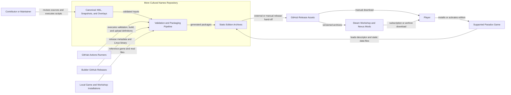
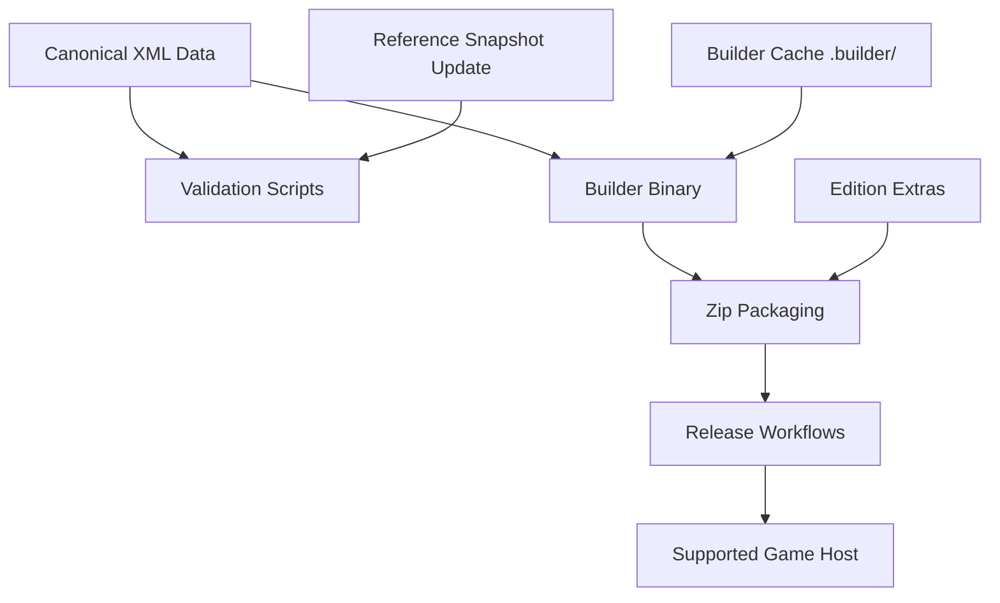
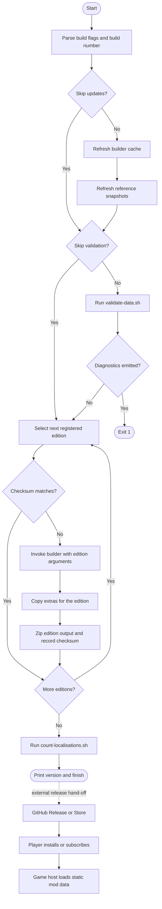
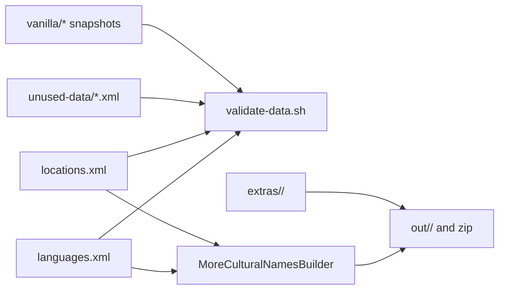
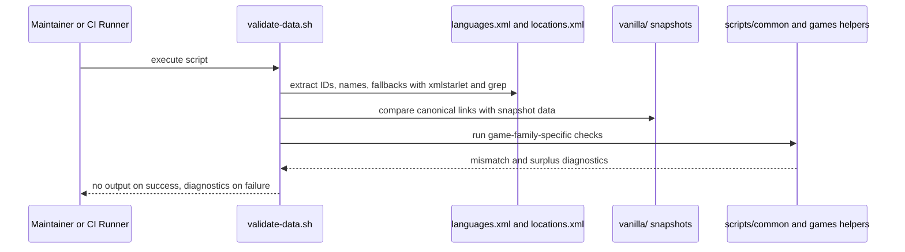
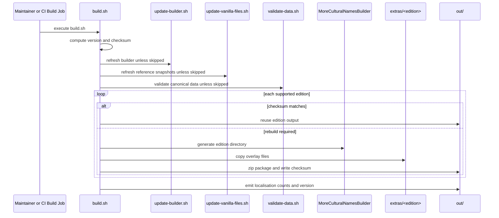
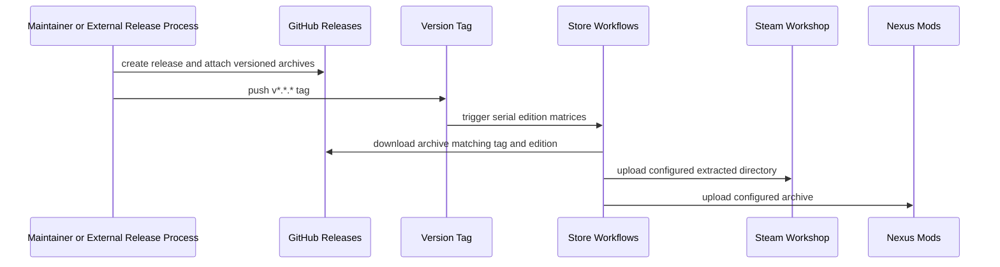
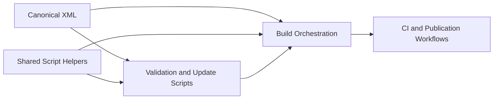

# More Cultural Names Architecture

This document records the current architecture of the More Cultural Names repository as of 31 August 2026. It covers repository-owned source data, validation and build automation, package generation, game-host integration, and release integrations for supported Paradox titles and companion mods. The external builder implementation and distribution-platform internals are outside its scope.

## 📑 Table of Contents

- [Purpose](#-purpose)
- [System Context](#-system-context)
- [Architectural Style](#-architectural-style)
- [Runtime Flow](#-runtime-flow)
- [Components](#-components)
- [Architectural Areas](#-architectural-areas)
  - [Canonical Source Data](#canonical-source-data)
    - [Build and Validation Scripts](#build-and-validation-scripts)
    - [Reference Snapshots and Extras](#reference-snapshots-and-extras)
    - [Publication and Storefront Assets](#publication-and-storefront-assets)
- [Data Architecture](#-data-architecture)
- [Interfaces and Integrations](#-interfaces-and-integrations)
- [Key Flows](#-key-flows)
  - [Validation Flow](#validation-flow)
    - [Build and Packaging Flow](#build-and-packaging-flow)
  - [Release Publication Flow](#release-publication-flow)
- [Cultural Name Resolution Model](#-cultural-name-resolution-model)
- [Cross-Cutting Concerns](#-cross-cutting-concerns)
    - [Security and Privacy](#security-and-privacy)
  - [Error Handling](#error-handling)
  - [Observability](#observability)
  - [Configuration](#configuration)
    - [Concurrency and Resource Use](#concurrency-and-resource-use)
- [Dependency Direction and Rules](#-dependency-direction-and-rules)
- [External Dependencies](#-external-dependencies)
- [Deployment and Operations](#-deployment-and-operations)
- [Compatibility Contracts](#-compatibility-contracts)
- [Testing and Verification](#-testing-and-verification)
- [Design Constraints](#-design-constraints)
- [Extension Points](#-extension-points)
    - [Adding a Supported Edition](#adding-a-supported-edition)
    - [Extending Validation for a Game Family](#extending-validation-for-a-game-family)
- [Architecture Decisions](#-architecture-decisions)
- [Source Map](#-source-map)
- [Related Documentation](#-related-documentation)

## 🎯 Purpose

The repository’s principal responsibility is to maintain a canonical, game-agnostic catalogue of languages and location names, then transform that catalogue into multiple mod packages that conform to the directory structure and localisation rules of each supported game or community mod. This document is intended for contributors who revise the XML datasets, shell automation, release workflows, or compatibility assets, and for maintainers who need to evaluate the impact of a change across validation, build, and publication boundaries.

## 🌐 System Context

The system boundary contains the canonical datasets, validation and packaging scripts, edition overlays, distribution metadata, and static documentation. A maintainer or GitHub Actions runner initiates a finite batch operation. The pipeline consumes repository data, tracked reference snapshots, optional local game or workshop installations, and an externally downloaded builder binary. It emits static mod directories and archives; supported games subsequently load the installed descriptors, localisation, fonts, and other edition files. No repository code executes as a resident process within a game.



The principal external boundaries are:
- **Contributors and maintainers:** Revise the canonical data, execute scripts locally, and inspect validation results.
- **GitHub Actions:** Executes repository validation, build, and publication definitions under [.github/workflows](.github/workflows); credentials remain in repository secrets rather than source files.
- **More Cultural Names Builder:** External binary downloaded by [scripts/update-builder.sh](scripts/update-builder.sh) and invoked by [scripts/build.sh](scripts/build.sh) to emit game-specific mod structures.
- **Local Steam and workshop installations:** Optional local sources used by [scripts/update-vanilla-files.sh](scripts/update-vanilla-files.sh) to refresh reference snapshots under [vanilla](vanilla).
- **GitHub Releases:** Supplies archives to the store workflows, but no repository workflow creates the release or uploads the archives; that hand-off is external or manual.
- **Distribution platforms:** Steam Workshop distributes 19 configured editions and Nexus Mods distributes all 22 configured build editions.
- **Players and supported game hosts:** Players install or subscribe to an edition, and Crusader Kings II, Crusader Kings III, Hearts of Iron IV, or Imperator: Rome loads its static mod files. Victoria 3 has validation support but no registered build edition.

## 🏗️ Architectural Style

The verified architecture combines a data-centric batch pipeline with compatibility-oriented, host-loaded mod packages. The repository treats [languages.xml](languages.xml) and [locations.xml](locations.xml) as canonical source data, delegates game-specific rendering to an external builder binary, and retains repository-owned validation, snapshot generation, overlays, and packaging in shell scripts. The installed result is declarative game data rather than an independently executing application. This separation centralises editorial ownership but makes builder CLI, emitted layouts, game identifiers, and host versions compatibility contracts.



The principal architecture boundaries are:
- **Canonical data layer:** Owns language identifiers, game IDs, fallback chains, location identities, and multilingual names.
- **Automation layer:** Owns validation, reference refresh, builder acquisition, edition orchestration, and packaging.
- **Reference data layer:** Owns snapshots copied or derived from installed games and community mods for link verification.
- **Publication layer:** Owns store-upload definitions that consume existing GitHub release assets, but neither creates those releases nor transforms canonical data.
- **Host integration layer:** Consists of static descriptors and game-specific data loaded by a supported game; game process lifetime and name-selection execution remain host-owned.

## 🔄 Runtime Flow



The principal runtime sequence is:
1. [scripts/build.sh](scripts/build.sh) resolves paths from the current working directory and computes a date-based version plus a checksum from root XML, that version, and the builder version cached before refresh.
2. The build optionally runs [scripts/validate-data.sh](scripts/validate-data.sh) and aborts on any emitted validation diagnostics.
3. The build sequentially processes 22 explicit editions, reuses matching cached output or invokes the external builder, overlays [extras](extras), creates archives under the ignored `out/` directory, and prints localisation coverage.
4. A process outside the represented build workflow supplies those archives as GitHub release assets; tagged store workflows download and publish them.
5. A player installs or subscribes to an edition, after which the supported game host loads the static descriptor and data files according to its own mod lifecycle.

## 🧩 Components

| Component | Responsibility | Principal Dependencies | Lifetime or Ownership |
|-----------|----------------|------------------------|-----------------------|
| `languages.xml` | Canonical catalogue of languages, game-specific language IDs, and fallback chains | Referenced by validation scripts and the builder | Repository-owned source file |
| `locations.xml` | Canonical catalogue of location entities, per-game location IDs, multilingual names, and metadata such as Wikidata IDs | Referenced by validation scripts and the builder | Repository-owned source file |
| `unused-data/` | Staging area for unused or deferred languages and locations | Read by validation and coverage counting | Repository-owned source directory |
| `scripts/validate-data.sh` | Consistency checks between canonical data and game-specific reference data | `xmlstarlet`, shared shell helpers, `vanilla/` snapshots | Executed per validation or build run |
| `scripts/update-vanilla-files.sh` | Refreshes reference snapshots from local installations or remote fallbacks | Local Steam/workshop paths, `wget`, shared helpers | Executed on demand or from build preamble |
| `scripts/update-builder.sh` | Downloads and caches the current builder release in `.builder/` | GitHub API, `wget`, `unzip` | Executed on demand or from build preamble |
| `scripts/build.sh` | Orchestrates versioning, validation, builder invocation, extras copy, zip packaging, and checksum-based skipping | Canonical XML, builder cache, extras, shell utilities | Principal composition root for local and CI builds |
| `extras/<edition>/` | Supplies tracked thumbnails, fonts, localisation, and other edition-specific files after builder generation | Edition directory conventions and generated output | Repository-owned overlay data |
| `vanilla/` | Retains tracked game and companion-mod snapshots for validation | Local installations and one configured remote fallback | Repository-owned reference snapshots refreshed by scripts |
| `out/` | Holds generated edition directories, checksums, and release archives | Builder output, overlays, and `zip` | Ignored workspace state owned by each build run |
| `.github/workflows/*.yml` | Executes CI validation and builds, then publishes existing release assets to external platforms | GitHub Actions runners, repository scripts, release archives, and platform secrets | CI-owned workflow definitions |

## 🗂️ Architectural Areas

### Canonical Source Data

Paths:
- [languages.xml](languages.xml)
- [locations.xml](locations.xml)
- [unused-data/languages.xml](unused-data/languages.xml)
- [unused-data/locations.xml](unused-data/locations.xml)

Responsibilities:
- Define stable language identifiers independent of any single game.
- Map each canonical language or location to one or more game-specific identifiers.
- Store multilingual location names, optional adjectives, fallback relations, and editorial metadata.

Boundary rules:
- Source XML is the authoritative input for build and validation; generated mod output does not feed back into it.
- Game-specific IDs belong in the XML records rather than being scattered through build scripts.
- Unused data remains segregated under [unused-data](unused-data) so validation and coverage scripts can distinguish active from parked records.

### Build and Validation Scripts

Paths:
- [scripts/build.sh](scripts/build.sh)
- [scripts/validate-data.sh](scripts/validate-data.sh)
- [scripts/update-builder.sh](scripts/update-builder.sh)
- [scripts/update-vanilla-files.sh](scripts/update-vanilla-files.sh)
- [scripts/count-localisations.sh](scripts/count-localisations.sh)
- [scripts/common](scripts/common)
- [scripts/update-location-links](scripts/update-location-links)

Responsibilities:
- Resolve repository paths and local installation paths.
- Validate canonical data against internal invariants and external reference snapshots.
- Acquire the external builder and orchestrate per-edition packaging.

Boundary rules:
- Shared shell logic is centralised under [scripts/common](scripts/common) and game-family checks under [scripts/common/games](scripts/common/games).
- Validation scripts may read local game or workshop installations indirectly via refreshed `vanilla/` snapshots, but build scripts do not edit the canonical XML.
- The edition catalogue is declared in [scripts/build.sh](scripts/build.sh); each new edition requires an explicit entry rather than automatic discovery.

### Reference Snapshots and Extras

Paths:
- [vanilla](vanilla)
- [extras](extras)
- [assets](assets)

Responsibilities:
- Persist copied or derived upstream reference data used for validation.
- Provide edition-specific thumbnails, fonts, localisation, and other files copied on top of builder output.
- Store publication graphics and localisation text assets.

Boundary rules:
- Files under [vanilla](vanilla) are reference artefacts, not canonical authored content.
- Files under [extras](extras) are overlay content applied after builder output exists.
- Files under [assets](assets) support documentation and distribution presentation; unlike [extras](extras), they are not copied into generated editions by [scripts/build.sh](scripts/build.sh).

### Publication and Storefront Assets

Paths:
- [.github/workflows](.github/workflows)
- [docs](docs)
- [README.md](README.md)

Responsibilities:
- Validate repository changes in CI.
- Download existing GitHub release archives and publish configured editions to external distribution platforms.
- Provide static pages and contributor-facing distribution guidance.

Boundary rules:
- Publication workflows consume versioned archives; they neither rebuild release content nor create the required GitHub release assets.
- Static documentation under [docs](docs) complements distribution channels but does not serve as source input to builds.

## 💾 Data Architecture

The architecture revolves around canonical XML documents and filesystem artefacts. [languages.xml](languages.xml) stores language identities, external ISO codes where known, per-game language IDs, and fallback chains. [locations.xml](locations.xml) stores canonical location identities, per-game links, optional GeoNames, Pleiades, and Wikidata identifiers, plus `<Name>` records keyed by canonical language IDs. No database exists. The external builder projects active XML into game-specific files, [extras](extras) augments those files, and [scripts/build.sh](scripts/build.sh) writes ignored output. Reference snapshots in [vanilla](vanilla) are tracked derived data; `.builder/` and `out/` are ignored local caches.



| Data or Store | Owner | Representation and Storage | Lifecycle or Consistency |
|---------------|-------|----------------------------|--------------------------|
| `Language Catalogue` | Repository maintainers | XML in [languages.xml](languages.xml) | Revised manually; validated for link consistency and fallback references |
| `Location Catalogue` | Repository maintainers | XML in [locations.xml](locations.xml) | Revised manually; validated against game-specific IDs and reference snapshots |
| `Unused Editorial Data` | Repository maintainers | XML in [unused-data](unused-data) | Retained separately from active data; counted by coverage scripts but excluded from active builds |
| `Reference Snapshots` | Automation scripts | Text and YAML files in [vanilla](vanilla) | Refreshed from installed games or remote sources; can become stale between refresh runs |
| `Builder Cache` | Automation scripts | Downloaded binary and version file in `.builder/` | Replaced when the external builder release version changes |
| `Edition Overlays` | Repository maintainers | Static files under [extras](extras), arranged by edition and mod directory | Copied after builder generation; changes do not participate in the build checksum |
| `Edition Output` | Build orchestration | Generated directories, checksums, and zip archives in `out/` | Recreated on demand; reuse is keyed only by root XML, version, and the pre-refresh cached builder version |

## 🔌 Interfaces and Integrations

| Interface or Integration | Direction | Contract | Owner | Failure Semantics |
|--------------------------|-----------|----------|-------|-------------------|
| `Canonical XML Input` | Inbound | Repository-specific `Language` and `LocationEntity` XML consumed by shell checks and the builder; no XSD is present | Repository | Diagnostics become caller-visible output; the build aborts when that captured output is non-empty |
| `Builder CLI` | Outbound | `.builder/MoreCulturalNamesBuilder` receives source paths, edition identity, host version, output path, and optional landed-title or dependency arguments | [scripts/build.sh](scripts/build.sh) | A missing expected edition directory causes exit `200`; command failures are not independently translated |
| `Builder Release Service` | Outbound | Latest-release JSON and `more-cultural-names-builder_<version>_linux-x64.zip` from GitHub | [scripts/update-builder.sh](scripts/update-builder.sh) | Commands have no retry or integrity-verification layer; later file checks or commands expose incomplete acquisition |
| `Local Game File System` | Outbound | Linux Steam, workshop, and Paradox paths derived in [scripts/common/paths.sh](scripts/common/paths.sh) | [scripts/update-vanilla-files.sh](scripts/update-vanilla-files.sh) | Some absent single files retain an existing snapshot; unguarded multi-file globs can produce an empty or incomplete target |
| `GitHub Actions Validation` | Inbound | Master pushes, pull requests, and manual dispatch in [.github/workflows/validate.yml](.github/workflows/validate.yml) | GitHub Actions | Non-empty validation output or `shellcheck` errors fail the corresponding job |
| `GitHub Actions Build` | Inbound | Master pushes and manual dispatch in [.github/workflows/build.yml](.github/workflows/build.yml) | GitHub Actions | Builds all editions but defines no artefact upload or GitHub release creation step |
| `GitHub Release Asset Hand-Off` | Outbound | `mcn_<GAME>_<VERSION>.zip` assets must exist beneath a `v*.*.*` release tag | External or manual process | Store jobs fail during download when the tag or archive is absent; no in-repository producer closes this hand-off |
| `Steam Workshop Upload` | Outbound | Tag-triggered matrix publishes 19 configured edition directories with `hmlendea/steam-workshop-update@latest` | [.github/workflows/steam-workshop.yml](.github/workflows/steam-workshop.yml) | A failed matrix job records failure for that edition; jobs are serialised and include a 30-second cooldown |
| `Nexus Mods Upload` | Outbound | Tag-triggered or manually dispatched matrix publishes all 22 archives with `Nexus-Mods/upload-action@v1.0.0-beta.10` | [.github/workflows/nexus-mods.yml](.github/workflows/nexus-mods.yml) | Download or upload failure terminates that edition's matrix job; jobs are serialised |
| `Supported Game Host` | Outbound | Generated descriptor and game-specific static files compatible with the edition's declared host version | External builder plus [extras](extras) | Parse, load-order, or host-version failures surface in the game; this repository has no in-game logging channel |

## 🔀 Key Flows

### Validation Flow



The validation flow is intentionally shell-based and diagnostic-oriented. Instead of producing a structured report, it emits human-readable findings only when a constraint is violated. CI and build orchestration both treat any emitted output as a failure signal, so the absence of output is a compatibility contract between [scripts/validate-data.sh](scripts/validate-data.sh) and its callers.

### Build and Packaging Flow



The build flow has a single composition root in [scripts/build.sh](scripts/build.sh). Each of the 22 editions is declared explicitly with game ID, host-version compatibility, metadata, and optional arguments such as landed-title file names or dependencies. The reuse checksum combines only root XML content, the computed version, and the builder version read before any update. It excludes scripts, snapshots, and extras, so changes to those inputs require a version change or output removal to force regeneration.

### Release Publication Flow



The release publication jobs do not regenerate mod content. They require a GitHub release for the selected tag to contain correctly named archives, yet the repository contains no workflow that creates that release or uploads build output. Once this external prerequisite is satisfied, Steam extracts and publishes 19 configured directories while Nexus publishes 22 archives. Publication is therefore coupled to tag, version, archive naming, and a manual or external release-production operation.

## ⚙️ Cultural Name Resolution Model

The repository’s domain model is built around a canonical identity layer that decouples editorial data from any single game’s nomenclature. Languages are identified once, may carry ISO code metadata, and can list multiple `GameId` mappings plus `FallbackLanguages`. Locations are likewise identified once, can list multiple game mappings and fallback locations, and attach many `<Name>` records keyed by canonical language IDs. The external builder owns the precise fallback-resolution and target-rendering algorithms; this repository supplies their inputs and verifies selected link and ordering invariants. At game runtime, the host consumes the emitted static files and owns the final selection and display conduct.

This model has two architectural consequences:
- The repository can support multiple games and mod variants without duplicating the full editorial name catalogue per target.
- Compatibility depends upon the continued stability of canonical IDs and fallback semantics, because those identifiers are referenced by data, validation scripts, and the builder contract.

## 🧵 Cross-Cutting Concerns

### Security and Privacy

The repository does not intentionally process personal data as part of its build artefacts. The main trust boundaries are CI secrets for Steam and Nexus publication, local file-system access to installed games, and downloaded binaries or actions. Publication credentials originate in GitHub Actions secrets and are not embedded in source. [scripts/update-builder.sh](scripts/update-builder.sh) selects the latest external builder and does not verify a digest or signature, while the Steam action uses a mutable `latest` reference; these external artefacts therefore execute within a trusted maintainer or CI context.

### Error Handling

Failure handling is mixed. [scripts/build.sh](scripts/build.sh) aborts when captured validation output is non-empty and exits `200` when the expected builder output directory is absent. The shell scripts do not activate `set -e`, and update scripts have no structured retry or rollback, so individual download, copy, ownership, and transformation commands can fail without immediate process termination. Validation emits human-readable diagnostics and normally concludes with status zero; its callers own the non-empty-output failure policy.

### Observability

Operational observability is limited to standard output, standard error, and CI job logs. [scripts/build.sh](scripts/build.sh) prints high-level progress, reuse decisions, and the computed mod version. [scripts/count-localisations.sh](scripts/count-localisations.sh) prints per-game counts and coverage ratios. There is no metrics, tracing, or machine-readable report channel, so diagnosing a failure depends upon shell output preserved by the invoking terminal or CI job.

### Configuration

| Configuration Area | Source | Responsibility | Override or Secret Policy |
|--------------------|--------|----------------|---------------------------|
| `Repository Paths` | [scripts/common/paths.sh](scripts/common/paths.sh) | Resolves source, output, extras, snapshot, and local installation directories | Derived from `pwd`, `HOME`, and expected Steam or Paradox directories |
| `Build Version` | First positional argument to [scripts/build.sh](scripts/build.sh) | Controls the patch component of the generated version string | Defaults to `0` when absent or invalid |
| `Build Flags` | Command-line switches to [scripts/build.sh](scripts/build.sh) | Permits skipping snapshot updates or validation | Plain-text local operator input |
| `Builder Version` | GitHub release metadata plus `.builder/version.txt` | Selects the cached builder binary version | External source; cached locally after download |
| `Edition Catalogue` | Explicit calls in [scripts/build.sh](scripts/build.sh) | Defines 22 mod IDs, names, game IDs, host versions, and builder options | Revised in source; no discovery or manifest override |
| `Store Matrices` | Steam and Nexus workflow definitions | Maps editions to platform application, item, and file identifiers | Revised in source; Steam and Nexus matrices differ intentionally |
| `Publication Secrets` | GitHub Actions secrets | Authenticates Steam and Nexus uploads | Secret-only; not stored in the repository |

### Concurrency and Resource Use

The principal automation is sequential. [scripts/build.sh](scripts/build.sh) iterates editions one by one and writes into a shared `out/` directory, which simplifies packaging and checksum management at the cost of longer wall-clock duration. Both release workflows declare `max-parallel: 1`, and the Steam workflow adds a deliberate cooldown to reduce authentication rate limiting. Local snapshot refreshes and validation can scan large text collections under installed games or workshop mods, so disk I/O dominates more than CPU concurrency.

## 🧭 Dependency Direction and Rules

The permitted dependency direction flows from canonical data to shared shell logic to orchestration and finally to publication. Reference snapshots and extras are supporting inputs, not sources of truth.



The principal dependency rules are:
- Canonical XML remains the authoritative editorial source; `vanilla/` snapshots and generated output may validate or derive from it but must not replace it.
- Shared helpers under [scripts/common](scripts/common) may be imported by top-level scripts; top-level scripts should not duplicate game-path and parsing logic.
- Publication workflows consume versioned release artefacts and must not own canonical data transformation logic or presume that the CI build job publishes them.
- Extras are overlays on generated output and must not encode assumptions that contradict the canonical XML or builder contracts.
- Supported game hosts depend upon emitted package contracts; repository automation does not depend upon host runtime state except when installations are intentionally read to refresh snapshots.

## 📦 External Dependencies

| Dependency | Responsibility | Integration Boundary | Architectural Consequence |
|------------|----------------|----------------------|---------------------------|
| `More Cultural Names Builder` | Transforms canonical XML into game-specific mod file structures | [scripts/update-builder.sh](scripts/update-builder.sh) and [scripts/build.sh](scripts/build.sh) | Core transformation logic lives outside this repository, so builder compatibility is a critical contract |
| `xmlstarlet` | Structured XML selection during validation | [scripts/validate-data.sh](scripts/validate-data.sh) and [.github/workflows/validate.yml](.github/workflows/validate.yml) | Validation requires a non-default system package in CI and on contributor machines |
| `shellcheck` | Static verification of shell scripts in CI | [.github/workflows/validate.yml](.github/workflows/validate.yml) | Shell automation quality is guarded separately from data validation |
| `wget`, `curl`, `unzip`, `zip` | Download, extraction, and packaging utilities | Build and update scripts | Local builds require these system utilities and network access for refresh operations |
| `GNU text utilities`, `file`, `iconv`, and `Perl` | Parse, normalise, compare, and transcode game data | Validation, snapshot, and reporting scripts | Automation is coupled to a Linux/GNU-style command environment rather than a platform-neutral runtime |
| `GitHub Actions` | Hosted automation for validation and publication | [.github/workflows](.github/workflows) | Release correctness depends upon workflow continuity and secret configuration |
| `Steam Workshop Update Action` | Uploads built editions to Steam Workshop | [.github/workflows/steam-workshop.yml](.github/workflows/steam-workshop.yml) | External action behaviour and Steam authentication policies influence release reliability |
| `Nexus Mods Upload Action` | Uploads release archives to Nexus Mods | [.github/workflows/nexus-mods.yml](.github/workflows/nexus-mods.yml) | Store publication is coupled to third-party action semantics and Nexus API availability |
| `Supported Paradox Games` | Load generated descriptors, localisation, fonts, and target-specific data | Installed edition package | Host parser, load-order, and version conventions define the effective runtime contract |

## 🚀 Deployment and Operations

This repository does not deploy a long-running service. Its operational model is a locally or CI-invoked build workspace that emits static mod packages and publication assets.

| Concern | Current Design | Architectural Consequence |
|---------|----------------|---------------------------|
| Process topology | One shell-driven process tree per validation or build run | No inter-process coordination layer is required |
| Deployment unit | 22 versioned zip archives for CK2, CK3, HOI4, and IR editions; Steam maps 19 and Nexus maps 22 | Edition, archive, mod-directory, and store-matrix identifiers require coordinated revision |
| Persistent state | Canonical XML, snapshots, extras, and workflows are tracked; `.builder/` and `out/` are ignored workspace state | Operators can reproduce packages only with compatible external tooling and sufficiently current snapshots |
| Scaling | Edition builds and store uploads are serialised | State management is simple, but full-release duration grows with the edition catalogue |
| Recovery | Failed operations are manually rerun; per-edition checksums can reuse prior local output | There is no transactional rollback, and incomplete update commands can require manual cache or output removal |
| File-system requirements | Scripts derive the repository root from `pwd` and local sources from Linux Steam and Paradox conventions | Principal scripts must execute from the repository root; complete snapshot refresh is environment-sensitive |
| Network requirements | Builder refresh and some snapshot fallbacks depend on remote downloads; store publication depends on external APIs | Offline builds are only possible when the builder cache and required snapshots already exist |
| Release hand-off | Store workflows consume archives from an existing GitHub release, but no workflow produces that release | A maintainer or external process must create the release and attach every required archive before publication succeeds |

## 🛡️ Compatibility Contracts

| Contract | Owner | Invariant | Verification | Change Policy |
|----------|-------|-----------|--------------|---------------|
| `Canonical Language IDs` | Repository maintainers | IDs used in XML names and fallback chains remain stable enough for builder and validation consumers | Manual review plus [scripts/validate-data.sh](scripts/validate-data.sh) | Renaming requires coordinated data and builder changes |
| `Canonical Location IDs` | Repository maintainers | IDs remain the join key for per-game mappings and generated output | Manual review plus [scripts/validate-data.sh](scripts/validate-data.sh) | Treat as compatibility-sensitive identifiers |
| `Builder CLI Arguments` | Build orchestration | The builder continues to accept the argument set encoded in [scripts/build.sh](scripts/build.sh) | Build execution | Any CLI change requires script updates before releases can proceed |
| `Release Archive Naming` | CI publication workflows | Archives follow `mcn_<GAME>_<VERSION>.zip` naming | Release workflow preparation steps | Changing the naming scheme requires coordinated workflow revision |
| `Edition Directory Layout` | Builder plus extras overlay | Each built edition contains the expected mod directory and descriptor file used for zipping and upload | Build execution and store upload runs | Layout changes require builder, extras, and workflow coordination |
| `No Output Means Validation Success` | Validation scripts and callers | [scripts/validate-data.sh](scripts/validate-data.sh) emits nothing when all checks pass | Local and CI validation execution | Preserve this caller-visible contract or revise every caller |
| `Edition and Store Matrices` | Build and publication automation | Build and Nexus identifiers align for 22 editions; Steam intentionally contains 19 non-CK2 entries | Local package enumeration plus workflow review | Addition, removal, or rename requires coordinated script, overlay, and applicable store-matrix revisions |
| `Repository-Root Invocation` | Shared path resolution | [scripts/common/paths.sh](scripts/common/paths.sh) interprets `pwd` as the repository root | Execute verification from the repository root | Relocatable invocation requires a coordinated path-resolution revision |

## ✅ Testing and Verification

Architecture verification is implemented primarily through shell-based data validation and CI static analysis rather than unit tests. The validated boundaries are canonical data integrity, selected alignment between game links and tracked upstream snapshots, and shell quality via `shellcheck`. A local complete build additionally confirms that the external builder can generate every declared edition and that overlays and package layouts remain usable. Commands must execute from the repository root.

Execute the principal automated verification with:

```bash
bash scripts/validate-data.sh | tr '\0' '\n'
```

Further architecture-sensitive verification commands are:

```bash
shopt -s globstar nullglob; shellcheck **/*.sh --severity error
```

```bash
bash scripts/build.sh --skip-validation --skip-updates
```

Material coverage gaps remain:
- There are no repository-local unit tests for the transformation logic because that logic resides in the external builder.
- Full snapshot refresh validation depends upon local game or workshop installations matching the path assumptions in [scripts/common/paths.sh](scripts/common/paths.sh).
- Release workflows verify upload automation only when tagged or manually dispatched; they are not fully exercised on every change.
- The CI build job invokes validation without installing `xmlstarlet`, unlike the dedicated validation workflow, and does not retain `out/` as an Actions artefact.
- Validation includes inactive and commented checks, uses textual heuristics without an XML schema, and communicates success through empty output rather than its exit status.

## ⚠️ Design Constraints

- **External Builder Dependency:** The repository delegates core file emission to an external binary, which reduces duplicated logic but creates a hard compatibility boundary outside the repository.
- **Environment-Sensitive Snapshot Refresh:** [scripts/update-vanilla-files.sh](scripts/update-vanilla-files.sh) assumes Linux installation paths, mutates tracked files, and has only one active remote fallback, so refresh is not uniformly reproducible.
- **Large Canonical Datasets:** The XML catalogues are substantial and edited directly, which keeps the source of truth simple but makes schema drift and merge conflicts more probable.
- **Serial Edition Catalogue:** Supported editions are enumerated manually in [scripts/build.sh](scripts/build.sh), so onboarding a new target is explicit but not declarative.
- **Shell-Centric Diagnostics:** Validation reports are human-readable text streams rather than structured artefacts, which is adequate for maintainers but less amenable to tooling reuse.
- **Partial Reuse Key:** Edition checksums omit scripts, snapshots, and overlays and capture the builder version before refresh, so cache reuse is not a complete content-addressed build guarantee.
- **External Release Production:** CI builds packages but neither retains them as workflow artefacts nor creates GitHub releases, leaving a required publication phase outside repository automation.
- **Working-Directory Coupling:** Shared paths derive from `pwd`, so invoking principal scripts outside the repository root misresolves all repository-relative resources.

## 🔧 Extension Points

### Adding a Supported Edition

1. Add or revise the game-specific canonical mappings in [languages.xml](languages.xml) and [locations.xml](locations.xml).
2. Add the edition’s reference snapshot handling and local path definitions where necessary in [scripts/common/paths.sh](scripts/common/paths.sh) and [scripts/update-vanilla-files.sh](scripts/update-vanilla-files.sh).
3. Register the edition in [scripts/build.sh](scripts/build.sh), create its [extras](extras) layout, and add validation coverage required to preserve packaging and link contracts.
4. Add the edition to the Nexus matrix and, when the host is distributed through Steam, to the Steam matrix with corresponding external identifiers.

The extension must preserve the existing archive naming convention, builder CLI contract, and any extras overlay expectations for the target edition.

### Extending Validation for a Game Family

1. Implement the game-family-specific helper logic under [scripts/common/games](scripts/common/games) or [scripts/update-location-links](scripts/update-location-links).
2. Call the new checks from [scripts/validate-data.sh](scripts/validate-data.sh) in the appropriate branch for that game family.
3. Add manual or CI verification to confirm the new diagnostics respect the no-output-on-success contract.

The extension must preserve caller expectations that validation emits actionable lines only for genuine mismatches and that top-level scripts can continue treating any output as failure.

## 📝 Architecture Decisions

| Decision | Rationale | Consequence | Record |
|----------|-----------|-------------|--------|
| Canonicalise languages and locations in shared XML files | Multiple games and companion mods reuse overlapping cultural and geographic data | Editorial reuse is high, but canonical IDs become compatibility-sensitive | Documented here |
| Keep validation and packaging in shell scripts | The repository integrates file-system snapshots, text utilities, and CI workflows directly | Automation is portable across contributor machines and CI, but observability and type safety are limited | Documented here |
| Delegate game-specific rendering to an external builder | One builder can encapsulate target-format generation for many supported editions | This repository owns source truth and orchestration, but not the complete transformation implementation | Documented here |
| Publish store updates from release assets rather than rebuilding in store jobs | Store jobs consume one immutable archive shape per edition | Publication depends upon strict naming and an unrepresented process that creates the GitHub release assets | Documented here |

## 🗺️ Source Map

| Area | Path |
|------|------|
| Canonical language data | [languages.xml](languages.xml) |
| Canonical location data | [locations.xml](locations.xml) |
| Unused editorial data | [unused-data](unused-data) |
| Build and validation scripts | [scripts](scripts) |
| Shared game-family helpers | [scripts/common/games](scripts/common/games) |
| Reference snapshots | [vanilla](vanilla) |
| Edition extras overlays | [extras](extras) |
| Store and CI workflows | [.github/workflows](.github/workflows) |
| Static distribution pages | [docs](docs) |
| Publication and visual assets | [assets](assets) |

## 📚 Related Documentation

[README.md](README.md) describes user-facing capabilities, supported games, installation paths, and contribution guidance.

[docs/workshop.html](docs/workshop.html), [docs/nexus.html](docs/nexus.html), and [docs/paradox.html](docs/paradox.html) provide distribution-channel landing pages rather than internal architectural detail.
